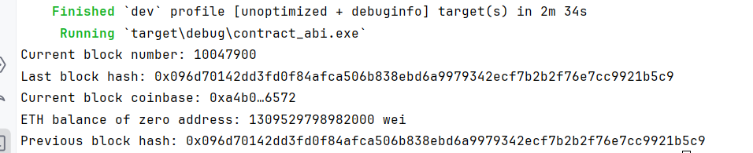

地址：0xcA11bde05977b3631167028862bE2a173976CA11
常用 view 方法：getBlockNumber() → 返回当前块号
getBlockHash(uint256 blockNumber) → 返回指定块的 hash
getCurrentBlockCoinbase() → 返回当前矿工地址
getEthBalance(address addr) → 返回任意地址的 ETH 余额
getLastBlockHash() → 最后一个块的 hash

终端结果：

